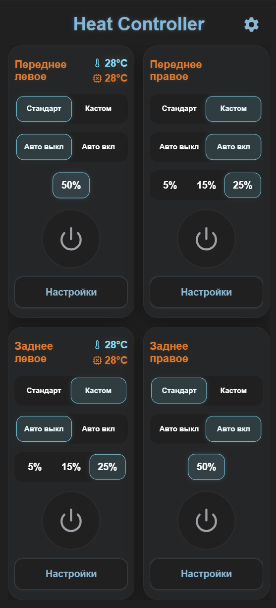
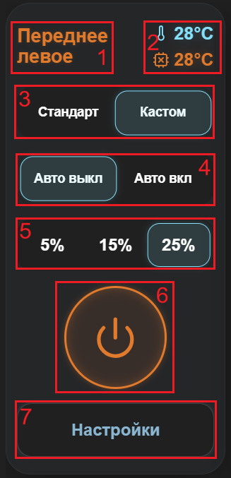
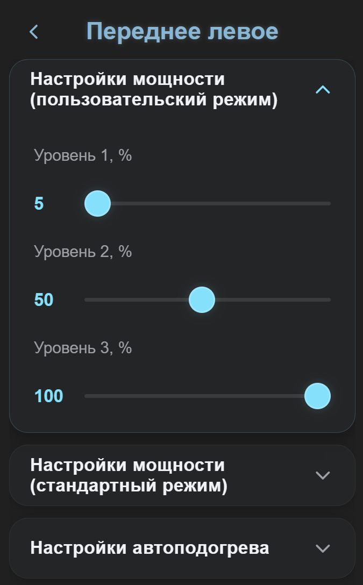
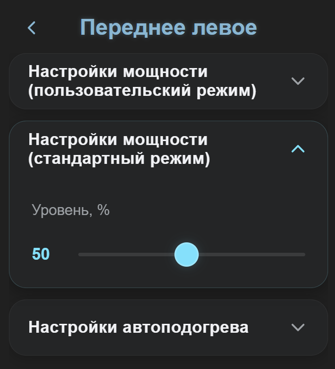
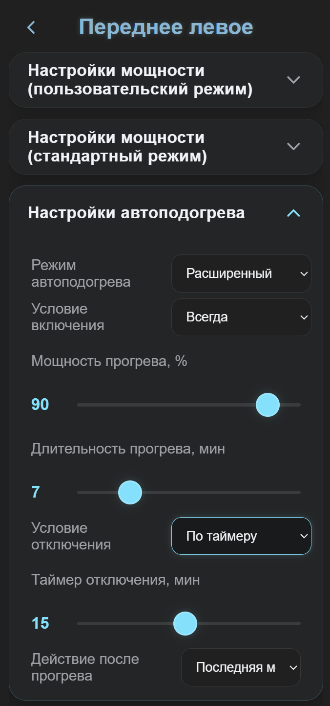
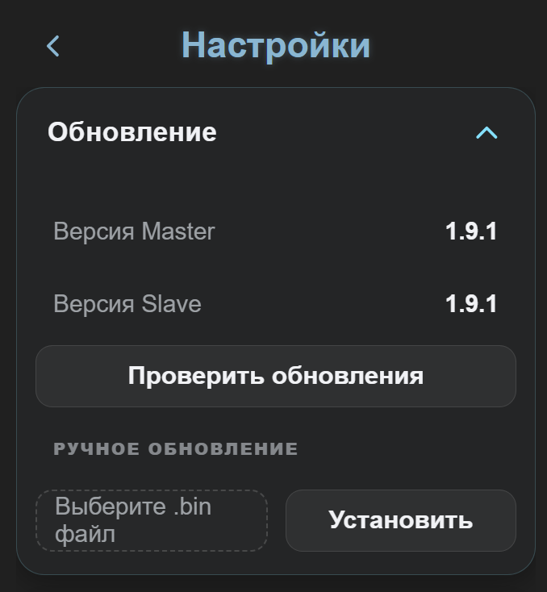
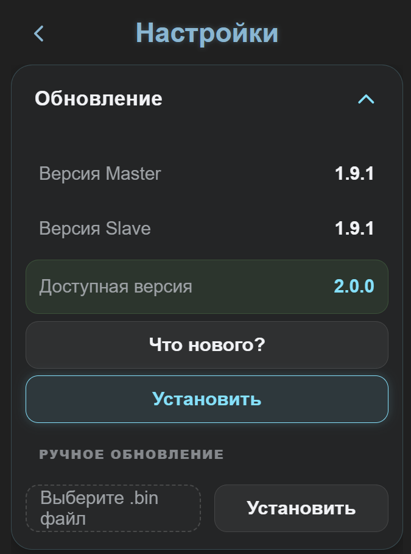
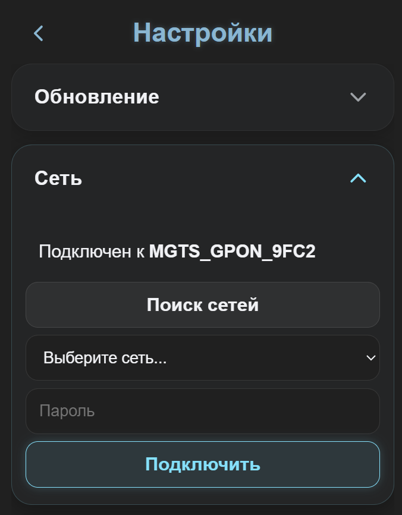
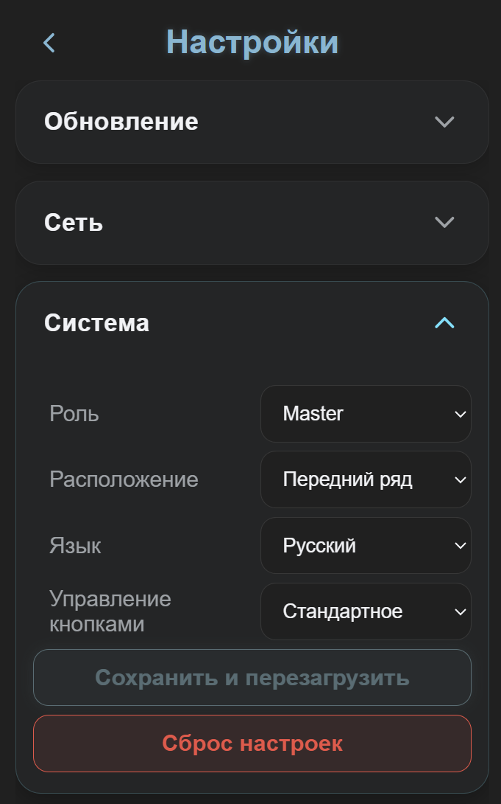
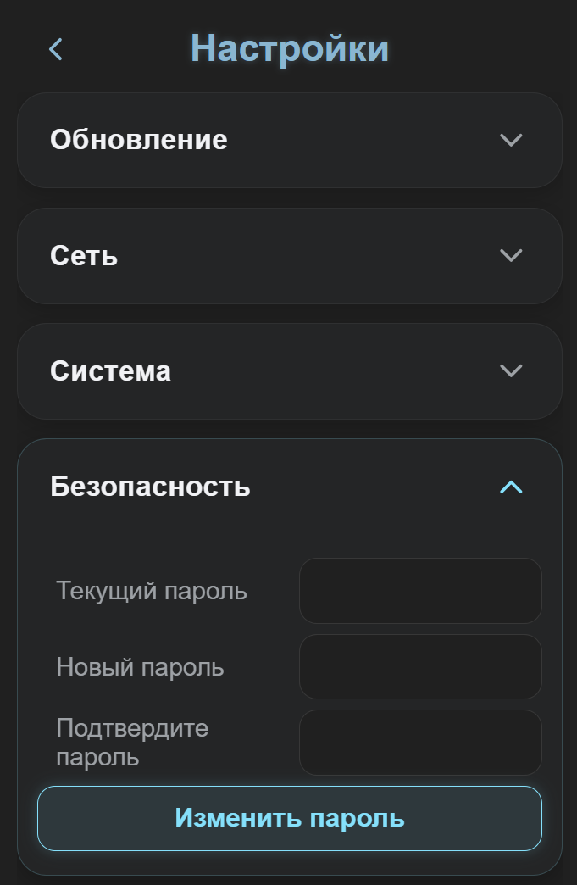

## Содержание

[1. Главный экран приложения](#1-главный-экран-приложения)
* [1.1. Настройки сиденья](#11-настройки-сиденья)
    * [1.1.1. Настройки мощности (пользовательский режим)](#111-настройки-мощности-пользовательский-режим)
    * [1.1.2. Настройки мощности (стандартный режим)](#112-настройки-мощности-стандартный-режим)
    * [1.1.3. Настройки автоподогрева](#113-настройки-автоподогрева)
        * [1.1.3.1. Умный режим](#1131-умный-режим)
        * [1.1.3.2. Расширенный режим](#1132-расширенный-режим)
[2. Экран настроек](#2-экран-настроек)
* [2.1. Обновление](#21-обновление)
* [2.2. Сеть](#22-сеть)
* [2.3. Система](#23-система)
* [2.4. Безопасность](#24-безопасность)

# 1. Главный экран приложения

Главный экран приложения (дашборд) выполнен в виде четырех независимых блоков, содержащих элементы управления, текущее состояние и настройки каждого сиденья.

**Элементы индикации и управления:**
1. Название сиденья и текущая фактическая мощность нагревателя.
2. Индикатор температуры воздуха в салоне и температуры платы (для настройки автоподогрева необходимо ориентироваться именно на температуру воздуха в салоне).
3. Переключатель режимов "Стандартный"/"Пользовательский".
4. Выключатель функции автоподогрева.
5. Переключатель уровней мощности.
6. Кнопка-индикатор ручного включения нагрева.
7. Кнопка "Настройки".

## 1.1. Настройки сиденья
Кнопка "Настройки" открывает окно настроек нагревателя соответствующего сиденья.

### 1.1.1. Настройки мощности (пользовательский режим)
Здесь можно настроить желаемую мощность для каждого из трех уровней подогрева в диапазоне от 5% до 100%.

### 1.1.2. Настройки мощности (стандартный режим)
Здесь можно настроить желаемую мощность для единственного уровня подогрева в диапазоне от 5% до 100%.

### 1.1.3. Настройки автоподогрева
Эта вкладка предназначена для настройки функции автоподогрева. Автоподогрев может работать в двух режимах "Умный" и "Расширенный".

#### 1.1.3.1. Умный режим

* **Диапазон температур** - это диапазон, в котором работает функция автоподогрева;
* **Диапазон длительности** - это диапазон значений времени прогрева, соответствующий диапазону установленному диапазону температур;
* **Мощность прогрева** - это мощность, с которой нагреватель будет прогревать сиденье при автоматическом включении;
* **Действие после прогрева** - это действие, которое автоматически выполнится по окончанию фазы прогрева.

> [!INFO] Прогрев
> *Прогрев - это фаза интенсивной работы нагревателя на повышенной мощности, целью которой является ускорение нагрева самого сиденья.*
> *Например, в соответствии с настроенными значениями на изображении автоподогрев может включаться при температуре от -30 до +10. При температуре -30 прогрев будет работать в течении 15 минут на мощности 90%, а при температуре +10 прогрев будет работать в течении 1 минуты на мощности 90%. После фазы прогрева нагреватель либо выключится, либо перейдет на мощность, установленную вручную, либо переключится на мощность, использованную в последней поездке. Если температура более +10 градусов, то автоподогрев уже не включится. Температура измеряется в момент запуска двигателя автомобиля.*

#### 1.1.3.2. Расширенный режим

* **Условие включения** - либо включается всегда вне зависимости от температуры салона, либо включается только при температуре ниже установленной;
* **Мощность прогрева** - это мощность, с которой нагреватель будет прогревать сиденье при автоматическом включении;
* **Длительность прогрева** - это время работы нагревателя на повышенной мощности;
* **Условие выключения** - нагрев выключается либо по таймеру, либо по температуре, либо не выключается вообще;
* **Действие после прогрева** - это действие, которое автоматически выполнится по окончанию фазы прогрева.

> [!INFO] AUTO
> *При работающем автоподогреве на дашборде в блоках соответствующих сидений поверх кнопки-индикатора включения подогрева сиденья будет отображаться пиктограмма "[AUTO]"*

# 2. Экран настроек

## 2.1. Обновление

Если в автомобиле используются две платы, то в данной вкладке будет отображаться информация о версии главной платы (Master) и ведомой платы (Slave); если используется одна плата, то будет отображаться только информация о главной плате (Master).
Наличие обновления прошивки плат проверяется автоматически при подключении к домашней сети WiFi с доступом к интернету, а также при нажатии на кнопку "Проверить обновления".

При наличии обновления появится кнопка "Что нового?" (описание изменений) и кнопка "Установить", которая непосредственно запускает процесс скачивания bin-файла с сервера и его установки (если в автомобиле установлены две платы, то их прошивка обновится последовательно - сначала ведомая, затем главная). При обновлении все настройки приложения и устройств сохраняются.

При отсутствии возможности подключения к домашней сети WiFi с доступом в интернет есть возможность ручного обновления. Для этого необходимо выполнить следующее:
- скачать bin-файл прошивки заранее (там, где есть доступ в интернет);
- сохранить скачанный файл на флэшку;
- в автомобиле подключить флэшку в левый USB-разъем;
- на вкладке "Обновление устройств" нажать кнопку "Выбрать файл", через файловый менеджер найти нужный bin-файл и выбрать его;
- нажать кнопку "Установить обновление" - и начнется процесс обновления прошивки устройств, полностью аналогичный описанному выше.

## 2.2. Сеть

Данная вкладка предназначена для настройки подключения плат к домашней сети (не путать с системными настройками беспроводных сетей в телефоне!). Например, чтобы подключить плату к точке доступа мобильного телефона, нужно выполнить поиск сетей и выбрать нужную сеть в выпадающем списке, а затем ввести пароль. После этого плата перезагрузится и подключится к указанной сети WiFi, а в строке "Статус" будет отображаться имя этой самой сети.

## 2.3. Система

На данной вкладке можно изменить следующие параметры:
* **Роль** - настройка, которая позволяет назначить одну из плат в качестве главной (Master), а вторую в качестве ведомой (Slave). Актуально только при использовании двух плат.
* **Расположение** - это настройка, которая определяет расположение сидений этой платы на виджетах в зависимости от фактического расположения платы в автомобиле. Например, можно использовать одну плату для заднего ряда не смотря на то, что она может являться главной.
* **Управление кнопками** - этот параметр позволяет выбрать одну из схем управления физическими кнопкам включения подогревов.

> [!WARNING] Важно
> *От параметров "Роль" и "Расположение" зависит базовый функционал прошивки, поэтому после их изменений необходимо нажать кнопку "Сохранить и перезагрузить"*

**Стандартное:**
- всё управление осуществляется одиночными нажатиями по схеме "Первый уровень мощности -> Второй уровень мощности -> Третий уровень мощности -> Выкл" (в пользовательском режиме) и по схеме "Вкл -> Выкл" (в стандартном режиме)

**Альтернативное:**
- длинное нажатие включает/выключает нагрев;
- короткое одиночное нажатие включает первый уровень мощности;
- короткое двойное нажатие включает второй уровень мощности;
- короткое тройное нажатие включает третий уровень мощности.

**Сброс настроек**
Нажатие кнопки "Сбросить" приведет в восстановлению к заводским значениям всех настроек платы, кроме "Роль", "Расположение" и "Сеть".

## 2.4. Безопасность

Настройки данной вкладки позволяют изменить пароль точки доступа плат. Для изменения пароля необходимо ввести текущий пароль, два раза ввести новый пароль и нажать кнопку "Изменить пароль".

> [!INFO] Пароль точки доступа
> *На всех платах пароль точки доступа по умолчанию "heat0000"*