## Содержание

1. [Первое подключение](#1-первое-подключение)
2. [Главный экран приложения](#2-главный-экран-приложения)
    1. [Настройки сиденья](#21-настройки-сиденья)
        1. [Настройки мощности (пользовательский режим)](#211-настройки-мощности-пользовательский-режим)
        2. [Настройки мощности (стандартный режим)](#212-настройки-мощности-стандартный-режим)
        3. [Настройки автоподогрева](#213-настройки-автоподогрева)
            1. [Умный режим](#2131-умный-режим)
            2. [Расширенный режим](#2132-расширенный-режим)
3. [Экран настроек](#3-экран-настроек)
    1. [Обновление](#31-обновление)
    2. [Сеть](#32-сеть)
    3. [Система](#33-система)
    4. [Безопасность](#34-безопасность)
    5. [Статистика устройств](#35-статистика-устройств)

# 1. Первое подключение

1. **Заглушить двигатель.**
2. **Заменить плату заднего ряда** (если плата одна, то пропустить п.2-п.7).
3. **Завести двигатель.**
4. **Включить в телефоне Wi-Fi** и открыть поиск доступных сетей.
5. В списке найденных сетей выбрать и подключиться к сети **"HeatControllerMaster"** (пароль `heat0000`). Откроется веб-интерфейс с панелью управления (если нет — откройте браузер и перейдите по адресу `192.168.4.1`).
6. Открыть **"Настройки"** -> **"Система"**, изменить **Роль** на **"Slave"**, нажать кнопку **"Сохранить и перезагрузить"** и подтвердить действие. Плата перезагрузится, соединение будет прервано.
7. **Заглушить двигатель.**
8. **Заменить плату переднего ряда.**
9. **Завести двигатель.**
10. В списке сетей снова выбрать и подключиться к сети **"HeatControllerMaster"**. Откроется веб-интерфейс, содержащий уже четыре сиденья (или перейдите по адресу `192.168.4.1`).
11. Выполнить настройку плат по желанию.

# 2. Главный экран приложения

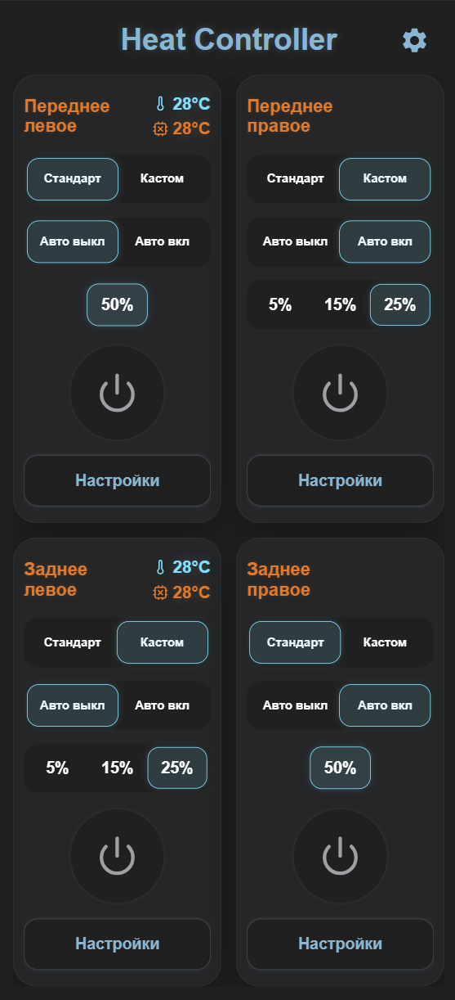

Главный экран приложения (дашборд) выполнен в виде четырех независимых блоков, содержащих элементы управления, текущее состояние и настройки каждого сиденья.

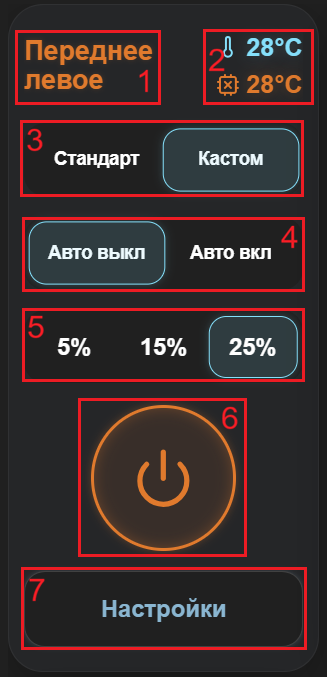

**Элементы индикации и управления:**
1. Название сиденья и текущая фактическая мощность нагревателя.
2. Индикатор температуры воздуха в салоне и температуры платы (для настройки автоподогрева необходимо ориентироваться именно на температуру воздуха в салоне).
3. Переключатель режимов "Стандартный"/"Пользовательский".
4. Выключатель функции автоподогрева.
5. Переключатель уровней мощности.
6. Кнопка-индикатор ручного включения нагрева.
7. Кнопка "Настройки".

## 2.1. Настройки сиденья
Кнопка "Настройки" открывает окно настроек нагревателя соответствующего сиденья.

> [!INFO] Сохранение настроек
> *Настройки сохраняются либо через 3 сек после изменений, либо при выходе из окна настроек.
> Изменения настроек автоподогрева (в том числе во время его работы) применяются только при следующем его включении.*

### 2.1.1. Настройки мощности (пользовательский режим)
Здесь можно настроить желаемую мощность для каждого из трех уровней подогрева в диапазоне от 5% до 100%.

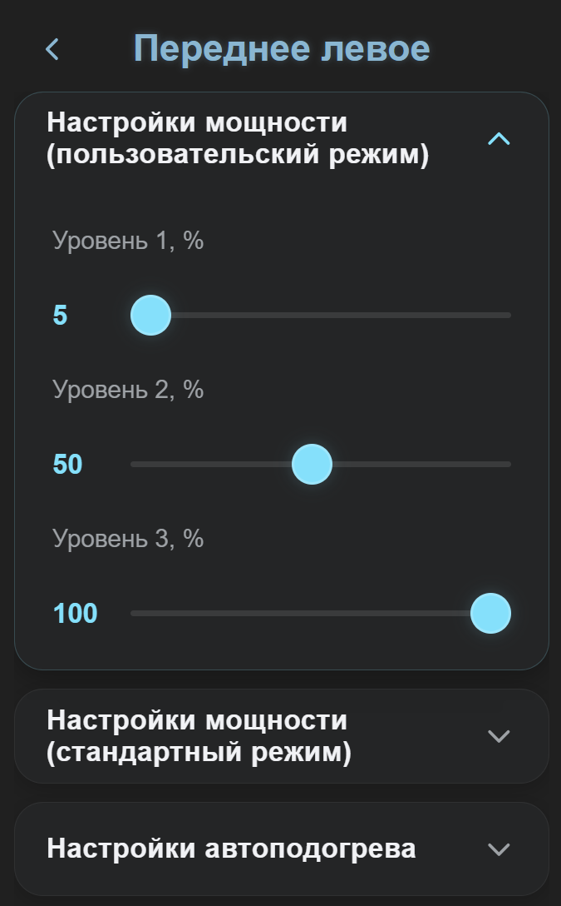

### 2.1.2. Настройки мощности (стандартный режим)
Здесь можно настроить желаемую мощность для единственного уровня подогрева в диапазоне от 5% до 100%.

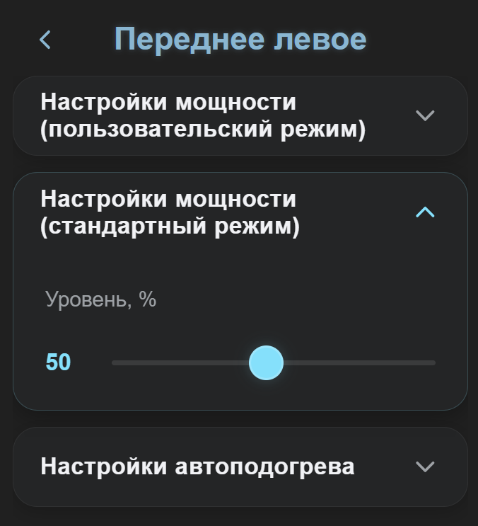

### 2.1.3. Настройки автоподогрева
Эта вкладка предназначена для настройки функции автоподогрева. Автоподогрев может работать в двух режимах "Умный" и "Расширенный".

#### 2.1.3.1. Умный режим

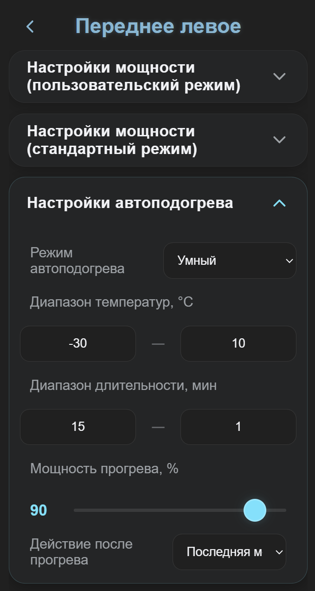

* **Диапазон температур** - это диапазон, в котором работает функция автоподогрева;
* **Диапазон длительности** - это диапазон значений времени прогрева, соответствующий диапазону установленному диапазону температур;
* **Мощность прогрева** - это мощность, с которой нагреватель будет прогревать сиденье при автоматическом включении;
* **Действие после прогрева** - это действие, которое автоматически выполнится по окончанию фазы прогрева.

> [!INFO] Прогрев
> *Прогрев - это фаза интенсивной работы нагревателя на повышенной мощности, целью которой является ускорение нагрева самого сиденья.*
> *Например, в соответствии с настроенными значениями на изображении автоподогрев может включаться при температуре от -30 до +10. При температуре -30 прогрев будет работать в течении 15 минут на мощности 90%, а при температуре +10 прогрев будет работать в течении 1 минуты на мощности 90%. После фазы прогрева нагреватель либо выключится, либо перейдет на мощность, установленную вручную, либо переключится на мощность, использованную в последней поездке. Если температура более +10 градусов, то автоподогрев уже не включится. Температура измеряется в момент запуска двигателя автомобиля.*

#### 2.1.3.2. Расширенный режим

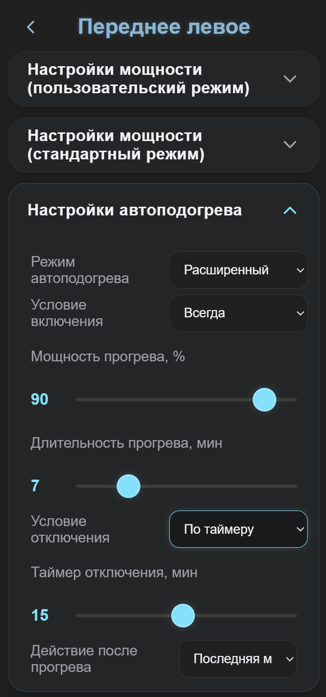

* **Условие включения** - либо включается всегда вне зависимости от температуры салона, либо включается только при температуре ниже установленной;
* **Мощность прогрева** - это мощность, с которой нагреватель будет прогревать сиденье при автоматическом включении;
* **Длительность прогрева** - это время работы нагревателя на повышенной мощности;
* **Условие выключения** - нагрев выключается либо по таймеру, либо по температуре, либо не выключается вообще;
* **Действие после прогрева** - это действие, которое автоматически выполнится по окончанию фазы прогрева.

> [!INFO] AUTO
> *При работающем автоподогреве на дашборде в блоках соответствующих сидений поверх кнопки-индикатора включения подогрева сиденья будет отображаться пиктограмма "[AUTO]"*

# 3. Экран настроек

## 3.1. Обновление

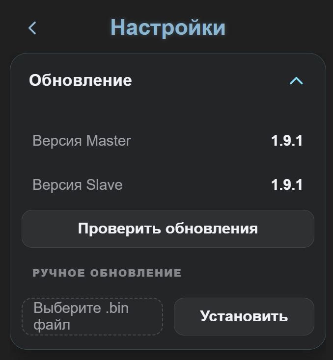

Если в автомобиле используются две платы, то в данной вкладке будет отображаться информация о версии главной платы (Master) и ведомой платы (Slave); если используется одна плата, то будет отображаться только информация о главной плате (Master).
Наличие обновления прошивки плат проверяется автоматически при подключении к домашней сети WiFi с доступом к интернету, а также при нажатии на кнопку "Проверить обновления".

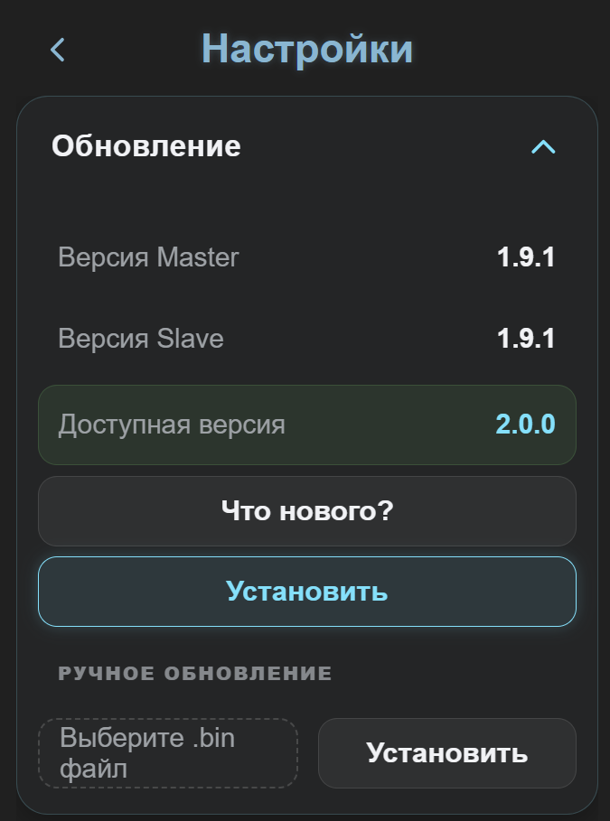

При наличии обновления появится кнопка "Что нового?" (описание изменений) и кнопка "Установить", которая непосредственно запускает процесс скачивания bin-файла с сервера и его установки (если в автомобиле установлены две платы, то их прошивка обновится последовательно - сначала ведомая, затем главная). При обновлении все настройки приложения и устройств сохраняются.

При отсутствии возможности подключения к домашней сети WiFi с доступом в интернет есть возможность ручного обновления. Для этого необходимо выполнить следующее:
- скачать bin-файл прошивки заранее (там, где есть доступ в интернет);
- сохранить скачанный файл на флэшку;
- в автомобиле подключить флэшку в левый USB-разъем;
- на вкладке "Обновление устройств" нажать кнопку "Выбрать файл", через файловый менеджер найти нужный bin-файл и выбрать его;
- нажать кнопку "Установить обновление" - и начнется процесс обновления прошивки устройств, полностью аналогичный описанному выше.

## 3.2. Сеть

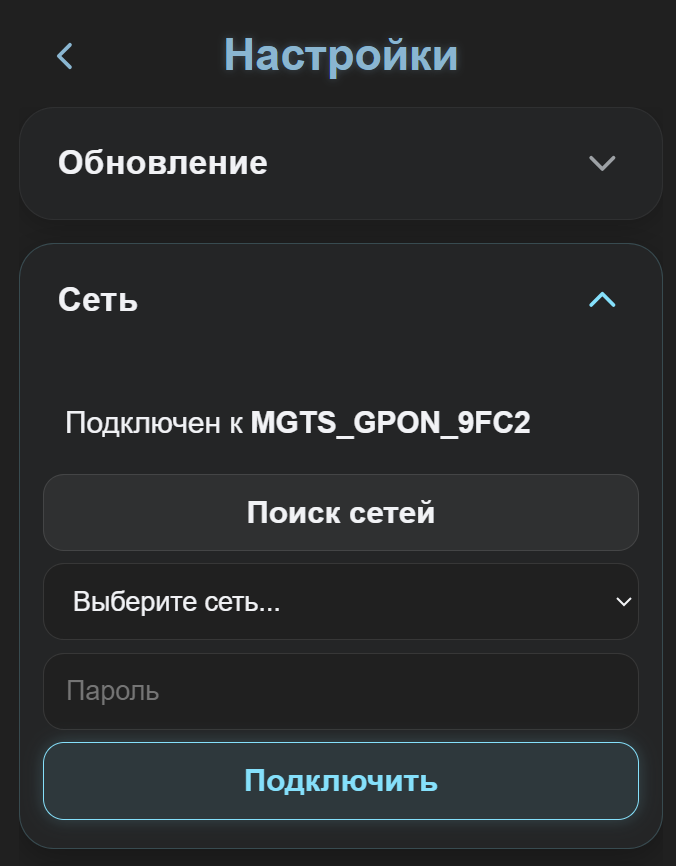

Данная вкладка предназначена для настройки подключения плат к домашней сети (не путать с системными настройками беспроводных сетей в телефоне!). Например, чтобы подключить плату к точке доступа мобильного телефона, нужно выполнить поиск сетей и выбрать нужную сеть в выпадающем списке, а затем ввести пароль. После этого плата перезагрузится и подключится к указанной сети WiFi, а в строке "Статус" будет отображаться имя этой самой сети.

## 3.3. Система

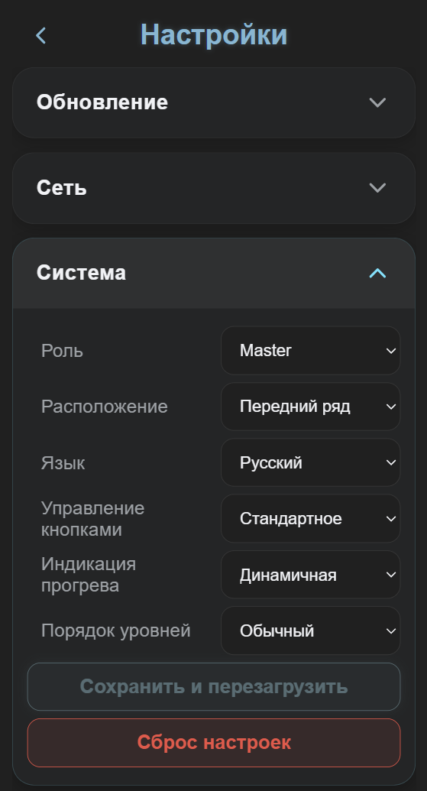

На данной вкладке можно изменить следующие параметры:
* **Роль** - настройка, которая позволяет назначить одну из плат в качестве главной (Master), а вторую в качестве ведомой (Slave). Актуально только при использовании двух плат.
* **Расположение** - это настройка, которая определяет расположение сидений этой платы на виджетах в зависимости от фактического расположения платы в автомобиле. Например, можно использовать одну плату для заднего ряда не смотря на то, что она может являться главной.

> [!WARNING] Важно
> *От параметров "Роль" и "Расположение" зависит базовый функционал прошивки, поэтому после их изменений необходимо нажать кнопку "Сохранить и перезагрузить"*

* **Язык** - изменение языка вебинтерфейса.
* **Управление кнопками** - этот параметр позволяет выбрать одну из схем управления физическими кнопкам включения подогревов.
	 **Стандартное:**
	 - всё управление осуществляется одиночными нажатиями по схеме "Первый уровень мощности -> Второй уровень мощности -> Третий уровень мощности -> Выкл" (в пользовательском режиме) и по схеме "Вкл -> Выкл" (в стандартном режиме)

	 **Альтернативное:**
	 - длинное нажатие включает/выключает нагрев;
	 - короткое одиночное нажатие включает первый уровень мощности;
	 - короткое двойное нажатие включает второй уровень мощности;
	 - короткое тройное нажатие включает третий уровень мощности.
- **Индикация прогрева** - изменение стиля светодиодной индикации в кнопках управления при прогреве.
- **Порядок уровней** - эта настройка позволяет реализовать соответствующую индикацию физических кнопок при переключении уровней нагрева от большего к меньшему (как в некоторых автомобилях VAG). То есть если в пользовательском (кастомном) режиме настроить уровни так, что первый уровень мощнее, чем второй и третий, и включить инвертированный порядок уровней, то при включении первого уровня светодиод в кнопке будет мигать 3 раза, а при включении третьего уровня - 1 раз.

**Сброс настроек**
Нажатие кнопки "Сбросить" приведет в восстановлению к заводским значениям всех настроек платы, кроме "Роль", "Расположение" и "Сеть".

## 3.4. Безопасность

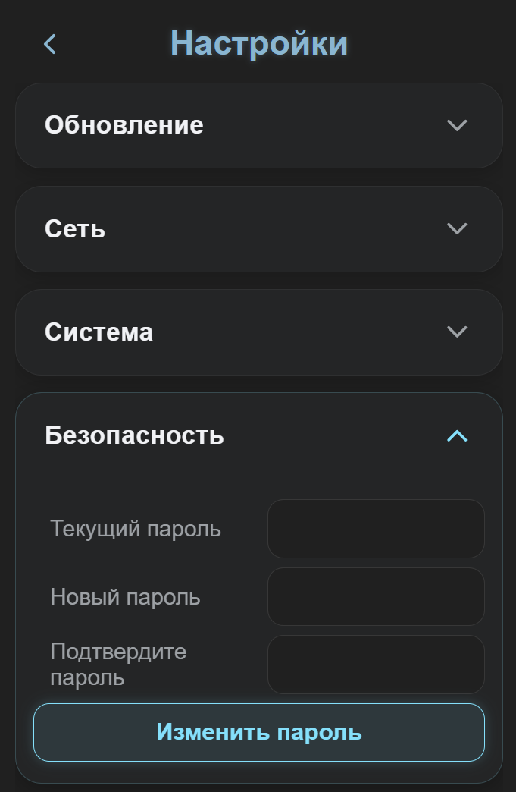

Настройки данной вкладки позволяют изменить пароль точки доступа плат. Для изменения пароля необходимо ввести текущий пароль, два раза ввести новый пароль и нажать кнопку "Изменить пароль".

> [!INFO] Пароль точки доступа
> *На всех платах пароль точки доступа по умолчанию "heat0000"*

## 3.5. Статистика устройств

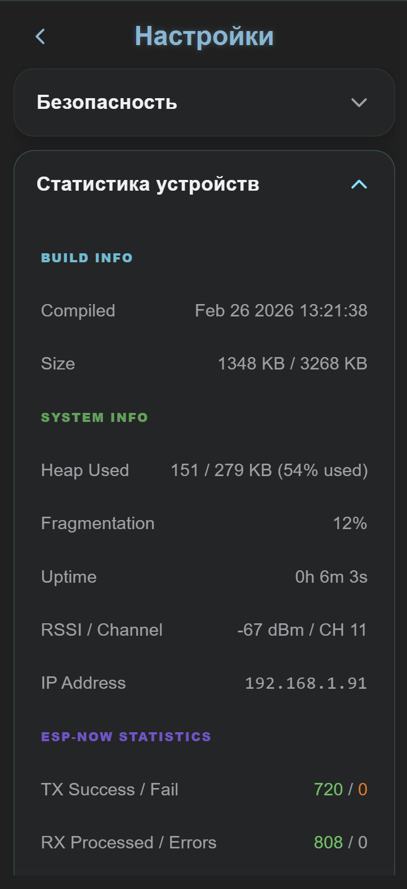

В этом разделе отображается системная информация о состоянии устройств.